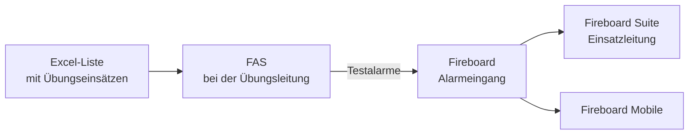
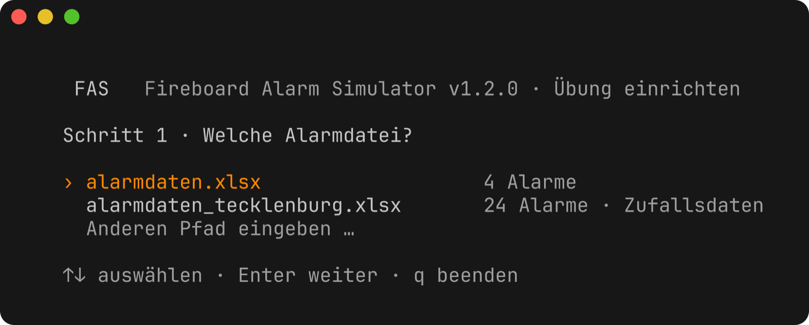
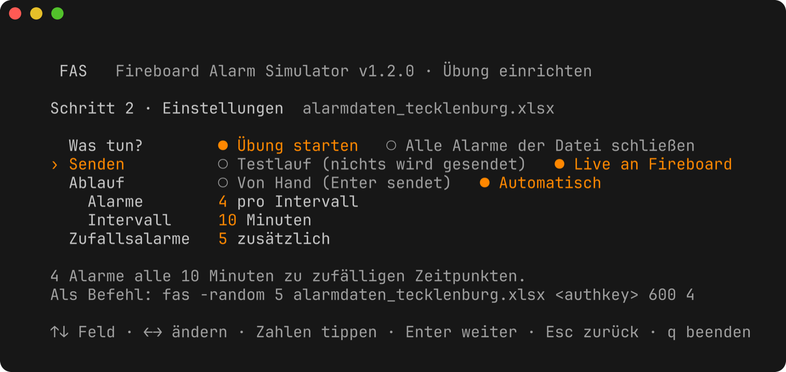
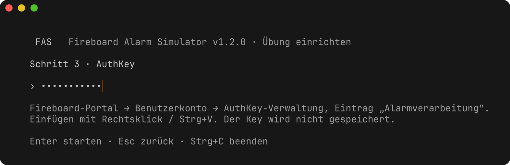
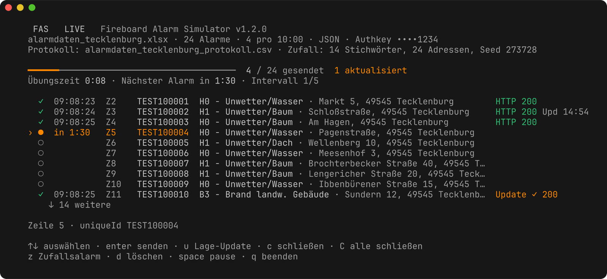

# Fireboard Alarm Simulator (FAS)

**Übungsalarme für Fireboard – einfach aus einer Excel-Liste.**

Du planst eine Übung für deine Feuerwehr, zum Beispiel eine Unwetterlage mit
vielen Einsätzen gleichzeitig? FAS spielt dabei die **Leitstelle**: Es schickt
die Einsätze aus deiner Excel-Liste in euren **Fireboard-Alarmeingang** – nach
und nach, zu festen Zeiten oder auf Knopfdruck. Eure Führungskräfte arbeiten sie
in Fireboard ab wie echte Einsätze.



Alle Alarme sind in Fireboard als **Testalarme** gekennzeichnet. FAS alarmiert
**keine Einsatzkräfte** – es gibt keine Piepser-, SMS- oder App-Alarmierung,
die Einsätze landen nur im Alarmeingang von Fireboard.

## Was FAS kann

- **Alarme automatisch verteilen** – z. B. 4 Einsätze alle 10 Minuten zu zufälligen Zeitpunkten
- **Drehbuch** – bestimmte Einsätze zu festen Zeiten („nach 20 Minuten brennt die Scheune“)
- **Von Hand** – die Übungsleitung schickt jeden Einsatz selbst ab
- **Lageänderungen** – ein Einsatz verschärft sich im Lauf der Übung (B2 → B3)
- **Zufallsalarme** – FAS würfelt Einsätze aus einer Stichwort- und Adressliste zusammen
- **Testlauf** – alles ausprobieren, ohne dass etwas gesendet wird
- **Protokoll** – jede Meldung mit Uhrzeit, für die Nachbesprechung
- **Fortsetzen** – Laptop ausgegangen? Die Übung geht dort weiter, wo sie aufgehört hat

## Was du brauchst

- einen **Laptop oder PC mit Windows 10/11** (ein Mac geht auch, siehe [Mac](#mac))
- ein **Fireboard-Konto** mit dem Modul *Alarmverarbeitung* – den dazugehörigen
  **AuthKey** findest du im Fireboard-Portal unter *Benutzerkonto →
  AuthKey-Verwaltung* (Eintrag „Alarmverarbeitung PLUS“)
- eine **Excel-Liste** mit deinen Übungseinsätzen – zwei Beispiele sind dabei

Installieren musst du nichts.

---

## In 5 Minuten zur ersten Übung


### 1. Herunterladen

Auf der
[Download-Seite](https://github.com/kventil/fireboard-alarm-simulator-releases/releases)
bei der neuesten Version die Datei **`…-windows-x64.zip`** herunterladen und
entpacken (Rechtsklick → *Alle extrahieren*). Im Ordner liegen:

- `fas.exe` – das Programm
- `alarmdaten.xlsx` und `alarmdaten_tecklenburg.xlsx` – Beispiel-Listen
- `README.md` – diese Anleitung (Bilder im Ordner `docs`)

### 2. Starten und Alarmliste wählen

**Doppelklick auf `fas.exe`.** Es öffnet sich ein Fenster mit dem
Startbildschirm. Mit den Pfeiltasten `↑` `↓` die Excel-Liste auswählen, dann
`Enter`.



> **Windows warnt beim ersten Start?** („Der Computer wurde durch Windows
> geschützt“) – das ist bei neuen Programmen normal. Auf *Weitere
> Informationen* → *Trotzdem ausführen* klicken.

Eigene Liste? Einfach die Excel-Datei in den Ordner von `fas.exe` legen – sie
erscheint dann hier. Oder die Datei direkt **auf `fas.exe` ziehen**.

### 3. Einstellungen

Mit `↑` `↓` zwischen den Zeilen wechseln, mit `←` `→` die Auswahl ändern.
Zahlen einfach eintippen.



| Einstellung | Bedeutung |
|---|---|
| **Senden** | *Testlauf*: nichts wird gesendet – zum Ausprobieren. *Live*: die Alarme gehen an Fireboard. |
| **Ablauf** | *Von Hand*: du schickst jeden Einsatz selbst ab. *Automatisch*: FAS verteilt die Einsätze, z. B. 4 Alarme alle 10 Minuten. |
| **Zufallsalarme** | Zusätzliche, zufällig zusammengestellte Einsätze (nur bei Listen mit Zufallsdaten). |
| **Was tun?** | Normalerweise *Übung starten*. Nach der Übung: *Alle Alarme der Datei schließen*. |

### 4. Erst mal testen

Lass *Senden* beim ersten Mal auf **Testlauf** und drück `Enter`. Die
Übungsansicht öffnet sich – du kannst in Ruhe alles ausprobieren, in Fireboard
kommt nichts an. Beenden mit `q`.

### 5. Übung live

FAS noch einmal starten, bei *Senden* **Live** wählen und `Enter`. Jetzt fragt
FAS nach dem **AuthKey**: eintippen oder mit Rechtsklick / `Strg+V` einfügen,
dann `Enter`. Der Key wird **nicht gespeichert** und bei jedem Start neu
abgefragt.



---

## Während der Übung



- **Oben** siehst du, ob wirklich gesendet wird (**LIVE**) oder nur geübt wird
  (**TESTLAUF**), und wie viele Alarme schon raus sind.
- **Übungszeit** läuft seit dem Start; bei Pause bleibt sie stehen.
- **Die Liste** zeigt jeden Einsatz: `Z4` ist Zeile 4 deiner Excel-Liste.

| Symbol | Bedeutung |
|---|---|
| `○` | wartet |
| `●` | kommt als Nächstes – mit Countdown |
| `◷` | kommt zu einer festen Zeit ([Drehbuch](#nach-drehbuch)) |
| `✓` | gesendet |
| `✗` | Fehler – was los ist, steht unter der Liste |
| `Update ✓` | Lageänderung wurde gesendet; `Upd 4:12` = kommt in 4:12 Minuten |

## Tasten

| Taste | Was passiert |
|---|---|
| `↑` `↓` | Einsatz auswählen |
| `Enter` | ausgewählten Einsatz **sofort** senden |
| `Leertaste` | **Pause** – alles hält an, bis du noch mal die Leertaste drückst |
| `u` | Lageänderung des Einsatzes senden |
| `c` | ausgewählten Einsatz in Fireboard **schließen** |
| `C` `C` | **alle** gesendeten Einsätze schließen (zweimal drücken) |
| `z` | einen [Zufallsalarm](#zufallsalarme) hinzufügen |
| `d` | Einsatz für diese Übung streichen (die Excel-Liste bleibt unverändert) |
| `q` | beenden |

---

## Die Alarmliste (Excel)

Jede Zeile ist ein Einsatz, in der ersten Zeile stehen die Spaltennamen. Am
einfachsten nimmst du eine der Beispiel-Listen und änderst sie ab.

| externalNumber | keyword | announcement | location | situation |
|---|---|---|---|---|
| UEB-001 | H1 - Unwetter/Baum | ÜBUNG - Baum auf Fahrbahn | Brochterbecker Straße 40, 49545 Tecklenburg | Baum liegt quer über beide Fahrstreifen |
| UEB-002 | H0 - Unwetter/Wasser | ÜBUNG - Wasser im Keller | Markt 5, 49545 Tecklenburg | ca. 20 cm Wasser im Keller |

| Spalte | Was kommt rein? |
|---|---|
| `externalNumber` | Einsatznummer – jede Nummer nur **einmal** |
| `keyword` | Einsatzstichwort |
| `announcement` | Alarmtext |
| `location` | Adresse der Einsatzstelle |
| `situation` | Meldebild |

Es gibt noch mehr Spalten – Meldender, Koordinaten, Lageänderungen, feste
Zeiten. Alle stehen in der [Spaltenübersicht](#alle-spalten).

**Tipp:** Telefonnummern und Koordinaten als **Text** eintragen, damit Excel
sie nicht umwandelt.

---

## Übungsarten

### Automatisch verteilt

*Ablauf* → **Automatisch**, dann Anzahl und Minuten einstellen, z. B. **4 Alarme
alle 10 Minuten**. Wann genau die Einsätze innerhalb der 10 Minuten kommen, ist
jedes Mal zufällig – die Anzahl stimmt aber immer.

### Von Hand

*Ablauf* → **Von Hand**. Nichts kommt von selbst: Du wählst in der
Übungsansicht einen Einsatz aus und schickst ihn mit `Enter` ab – ideal, wenn
die Übungsleitung auf die Lage reagieren will.

### Nach Drehbuch

Für Einsätze, die zu einer **festen Zeit** kommen sollen, bekommt die
Excel-Liste eine Spalte **`zeitpunkt`**, gemessen ab Übungsbeginn:

| zeitpunkt | Einsatz kommt … |
|---|---|
| `00:00` | sofort beim Start |
| `05:00` | nach 5 Minuten |
| `1:10:00` | nach 1 Stunde 10 Minuten |

Das lässt sich mischen: feste Schlüsselereignisse im Drehbuch, dazwischen
automatisch verteilte oder von Hand geschickte Einsätze. Ein Beispiel-Drehbuch:


### Lageänderungen

Ein Einsatz kann sich im Lauf der Übung verschärfen, z. B. von „Rauch aus dem
Scheunendach“ (B2) zu „Scheune brennt in voller Ausdehnung“ (B3). Dafür in der
Excel-Liste eintragen:

- `update_keyword` – das neue Stichwort (B3 …)
- `update_situation` – das neue Meldebild
- `update_after` – wie lange nach dem Alarm, z. B. `08:00` für 8 Minuten

Ohne `update_after` löst du die Lageänderung selbst mit der Taste `u` aus.

### Zufallsalarme

Keine Lust, jeden Einsatz einzeln zu schreiben? FAS kann Einsätze aus einer
Liste von **Stichwörtern** und einer Liste von **Adressen** zusammenwürfeln –
passend: Die brennende Scheune landet auf einem Hof, der umgestürzte Baum auf
einer Straße. Im Startbildschirm die Anzahl bei *Zufallsalarme* eintragen,
während der Übung kommen mit `z` weitere dazu.

Die Beispiel-Liste `alarmdaten_tecklenburg.xlsx` enthält schon 14 Stichwörter
und 24 Adressen. Wie du eigene anlegst, steht unter
[Zufallsalarme einrichten](#zufallsalarme-einrichten).

---

## Nach der Übung

- **Einsätze schließen:** `C` zweimal drücken. Oder später FAS starten und im
  Startbildschirm *Was tun?* → **Alle Alarme der Datei schließen** wählen. Die
  Einsätze verschwinden dann von den Fireboard-Geräten.
- **Nachbesprechung:** Neben der Excel-Liste liegt jetzt eine Datei
  `…_protokoll.csv`. Mit Excel öffnen – dort steht jede gesendete Meldung mit
  Uhrzeit, Übungszeit und Ergebnis.

---

## Häufige Fragen

**Werden unsere Einsatzkräfte alarmiert?**
Nein. FAS schickt die Einsätze nur in den Fireboard-Alarmeingang. Piepser,
Sirene, SMS oder Alarmierungs-Apps werden nicht ausgelöst.

**Sieht man in Fireboard, dass es eine Übung ist?**
Ja, alle Alarme sind als Testalarme gekennzeichnet. Zusätzlich empfehlen wir,
im Alarmtext „ÜBUNG“ voranzustellen – wie in den Beispiel-Listen.

**Wird mein AuthKey gespeichert?**
Nein, nie. Du gibst ihn bei jedem Start ein. Wer das nicht jedes Mal möchte,
kann ihn in eine Datei legen – siehe [AuthKey aus einer Datei](#authkey-aus-einer-datei).

**Der Laptop ist mitten in der Übung ausgegangen.**
Einfach FAS wieder starten. Es fragt „Letzte Übung fortsetzen?“ – mit `J` geht
es dort weiter, wo es aufgehört hat. Schon gesendete Einsätze werden **nicht**
noch einmal geschickt.

**Fehler 401**
Der AuthKey ist falsch, oder das Modul Alarmverarbeitung ist für euer Konto
nicht freigeschaltet. Den Key im Fireboard-Portal prüfen.

**„keine Verbindung“**
Kein Internet, oder eine Firewall bzw. ein Proxy blockiert. Unter der Liste
steht, woran es wahrscheinlich liegt.

**Statt Symbolen erscheinen seltsame Zeichen.**
Die alte Windows-Konsole kann nicht alle Zeichen darstellen. Unter Windows 11
ist das neue *Windows Terminal* Standard und zeigt alles richtig an.

**Der Einsatz kommt in Fireboard nicht an.**
Im Fireboard-Portal unter *Alarmeingang* nachsehen. Dort lassen sich die
Testalarme nach der Übung auch gesammelt löschen.

---

## Mac

Die Datei `…-macos-arm64.zip` (Mac mit Apple-Chip, M1 und neuer) bzw.
`…-macos-intel.zip` herunterladen und entpacken. Beim ersten Mal im Programm
*Terminal* die Download-Sperre entfernen und FAS starten:

```
cd ~/Downloads/fireboard-alarm-simulator-1.2.0-macos-arm64
xattr -d com.apple.quarantine fas
./fas
```

Danach genügt ein Doppelklick auf `fas` im Finder.

---
---

# Referenz

Die folgenden Abschnitte beschreiben alle Möglichkeiten im Detail.

## Aufruf und Optionen

```
fas                                   Startbildschirm
fas <exceldatei>                      Startbildschirm mit dieser Datei (auch per Drag & Drop)
fas [optionen] <exceldatei> <authkey> [<intervall-sek> <alarme-pro-intervall>]
fas [optionen] -keyfile <datei> <exceldatei> [<intervall-sek> <alarme-pro-intervall>]
```

Mit Excel-Datei und AuthKey startet FAS direkt ohne Startbildschirm. Der
Startbildschirm zeigt zu den gewählten Einstellungen den passenden Befehl an.

| Parameter | Bedeutung |
|---|---|
| `exceldatei` | Excel-Datei mit den Alarmen und optional den Daten für Zufallsalarme |
| `authkey` | AuthKey der Alarmdatenschnittstelle. `x` = Testlauf, es wird nichts gesendet |
| `intervall-sek` `alarme-pro-intervall` | Optional. Z. B. `600 4`: 4 Alarme je 600 Sekunden zu zufälligen Zeitpunkten. Ohne diese Angaben: manueller Modus |
| `-plain` | Einfache Textausgabe statt Oberfläche (automatischer Modus oder Drehbuch). Wird automatisch verwendet, wenn die Ausgabe umgeleitet wird |
| `-xml` | Alarme im XML-Format senden statt JSON |
| `-close` | Alle Alarme der Excel-Datei in Fireboard schließen und beenden |
| `-random anzahl` | So viele Zufallsalarme erzeugen und an die Alarme der Tabelle anhängen |
| `-seed n` | Startwert für Zufallsalarme: gleicher Seed = gleiche Übung. Ohne Angabe zufällig; der verwendete Seed steht im Kopf der Oberfläche |
| `-resume` / `-fresh` | Eine unterbrochene Übung ohne Nachfrage fortsetzen bzw. neu beginnen |
| `-keyfile datei` | AuthKey aus einer Textdatei lesen statt als Parameter, siehe unten |
| `FAS_URL` | Umgebungsvariable, ersetzt `https://login.fireboard.net/api` (z. B. für einen Testserver) |

Weitere Tasten: `j` `k` (wie `↑` `↓`), `g` / `G` (zum ersten / letzten Alarm),
`s` (wie `Enter`), `p` (wie Leertaste), `Entf` (wie `d`). Mit `Enter` lässt
sich ein bereits gesendeter Alarm erneut senden.

### AuthKey aus einer Datei

FAS speichert den AuthKey nie. Für wiederkehrende Übungen kann er in eine
Textdatei geschrieben werden (erste Zeile, z. B. `key.txt`) und mit `-keyfile`
übergeben werden – dann taucht er weder im Befehl noch in der Eingabe auf:

```
fas -keyfile key.txt alarmdaten.xlsx 600 4    # startet direkt
fas -keyfile key.txt                          # Startbildschirm, Key schon bekannt
```

Unter Windows lässt sich das per Verknüpfung auf einen Doppelklick legen:
Rechtsklick auf `fas.exe` → *Verknüpfung erstellen*, dann in den Eigenschaften
bei *Ziel* hinter `fas.exe` z. B. ` -keyfile key.txt` ergänzen. Die Key-Datei
wie ein Passwort behandeln und nicht weitergeben.

### Ablauf

Im automatischen Modus sendet der Countdown immer den nächsten noch offenen
Alarm ohne festen Zeitpunkt; von Hand gesendete Alarme verbrauchen keinen Platz
im Intervall. Nach dem letzten Alarm läuft das Programm weiter, damit Updates und
Schließen noch möglich sind.

## Alle Spalten

Die Alarme stehen im ersten Tabellenblatt (die Blätter für Zufallsalarme
ausgenommen). Die Reihenfolge der Spalten ist egal, fehlende Spalten werden
nicht übertragen, leere Zeilen übersprungen.

| Spalte | Inhalt |
|---|---|
| `externalNumber` | Leitstellen-/Einsatznummer |
| `keyword` | Einsatzstichwort |
| `announcement` | Alarmnachricht |
| `location` | Anschrift, z. B. `Markt 5, 49545 Tecklenburg` |
| `location_name` | Name des Geschädigten / Objekt |
| `location_info` | Zusatzinfo zur Einsatzstelle |
| `geo_location_auto` | `true`/`false`: automatische Georeferenzierung durch Fireboard |
| `geo_location_latitude`, `geo_location_longitude` | Koordinaten (WGS84, Punkt oder Komma) |
| `reporter_name`, `reporter_phone`, `reporter_info` | Meldender |
| `situation` | Meldebild |
| `timestampStarted` | Einsatzbeginn als Unix-Zeit (Sekunden oder Millisekunden); leer = Zeitpunkt des Eingangs |
| `uniqueId` | *optional* – eindeutige ID, sonst wird `externalNumber` verwendet |
| `update_keyword` | *optional* – neues Stichwort beim Lage-Update |
| `update_situation` | *optional* – neues Meldebild beim Lage-Update |
| `update_after` | *optional* – Update automatisch so lange nach dem Alarm senden: `mm:ss` (`10:00`) oder Sekunden (`600`); leer = nur von Hand mit `u` |
| `zeitpunkt` | *optional* – Drehbuch: Alarm zu dieser Übungszeit senden: `mm:ss`, `h:mm:ss` oder Sekunden; leer = Intervall bzw. von Hand |

- Zeiten (`zeitpunkt`, `update_after`) werden so gelesen, wie Excel sie anzeigt:
  `05:00` bedeutet 5 Minuten, auch wenn Excel daraus intern eine Uhrzeit macht.
- Jeder Alarm braucht eine eindeutige ID, sonst überschreiben sich die Alarme in
  Fireboard. Ohne `uniqueId` und `externalNumber` wird `FAS-<datei>-Z<zeile>`
  verwendet; doppelte IDs werden beim Start gemeldet.
- Ohne Koordinaten entscheidet die Georeferenzierungs-Einstellung im Portal, ob
  die Anschrift aufgelöst wird.
- Zeilen mit Fehlern (z. B. ungültige Zeitangabe) werden beim Start gemeldet und
  übersprungen.

Beispieldateien (in jeder Zip-Datei enthalten): `alarmdaten.xlsx`
(4 Beispielalarme) und `alarmdaten_tecklenburg.xlsx` (24 Unwetter-Einsätze mit
Lage-Updates, dazu 14 Stichwörter und 24 Adressen für Zufallsalarme).

## Zufallsalarme einrichten

Die Excel-Datei bekommt zwei weitere Tabellenblätter. Sie verwenden die gleichen
Spaltennamen wie die Alarmtabelle.

**`Stichwörter`** – ein Einsatzszenario pro Zeile, z. B. `keyword`,
`announcement`, `situation`, `update_keyword`, `update_situation`,
`update_after`, dazu:

| Spalte | Bedeutung |
|---|---|
| `gewicht` | Wie oft das Szenario im Verhältnis vorkommt (Standard 1; `5` = fünfmal so oft, `0` = nie) |
| `kategorie` | Nur Adressen mit einer dieser Kategorien verwenden, z. B. `landwirtschaft` oder `strasse, wohnhaus` |

**`Adressen`** – ein Einsatzort pro Zeile: `location`, `location_name`,
`location_info`, `geo_location_*` und `kategorie` (eine oder mehrere, durch
Komma getrennt).

So entsteht ein Zufallsalarm:

- Ein Szenario wird nach Gewicht gezogen, dazu eine Adresse mit passender
  Kategorie. So brennt die Scheune nur auf einem Hof, und der Baum liegt auf
  einer Straße.
- Jede Adresse kommt erst wieder dran, wenn alle anderen passenden einmal
  verwendet wurden.
- Fehlen `reporter_*`-Spalten, werden fiktive Meldende ergänzt (Nummern
  `0170-555…`).
- Zufallsalarme heißen in der Liste `R1`, `R2`, … und bekommen eindeutige IDs
  wie `ZUF-2609231512-001`.

Mit `-seed` lässt sich eine Übung exakt wiederholen, z. B. 20 Zufallsalarme,
4 je 10 Minuten:

```
fas -random 20 -seed 4711 alarmdaten_tecklenburg.xlsx <authkey> 600 4
```

Eine Datei nur mit den Blättern `Stichwörter` und `Adressen` funktioniert auch –
dann gibt es ausschließlich Zufallsalarme. `fas -close` schließt nur die
Alarme der Tabelle; Zufallsalarme mit `C` in der Oberfläche schließen.

## Lage-Updates und Schließen

Fireboard erkennt einen Alarm an seiner `uniqueId`. Wird dieselbe ID erneut
gesendet, aktualisiert Fireboard den vorhandenen Alarm – so werden Lage-Updates
übertragen.

Zum Schließen wird der Alarm mit `timestampClosed` erneut gesendet. Laut
Fireboard-Spezifikation wird er dann **auf den Endgeräten ausgeblendet**; ob das
auch den Einsatz in der Fireboard Suite abschließt, ist nicht dokumentiert. Da
die IDs aus der Excel-Datei stammen, lassen sich Alarme auch später noch
schließen: mit `c` in der Oberfläche oder `fas -close <datei> <authkey>`.

Die Übungszeit, `zeitpunkt` und `update_after` zählen ohne Pausen.

## Fortsetzen nach einer Unterbrechung

Beim Start liest FAS das Protokoll der Excel-Datei. Wurde die letzte Übung
nicht beendet, fragt es:

```
Die letzte Übung mit alarmdaten.xlsx wurde nicht beendet:
  12 Alarme gesendet, 9 davon offen, zuletzt am 23.09. 17:40 bei Übungszeit 0:45:10
Fortsetzen? [J/n]
```

- Beim Fortsetzen werden alle bereits gesendeten, aktualisierten und
  geschlossenen Alarme übernommen (Status „aus Protokoll“) und nicht erneut
  gesendet.
- Die Übungszeit läuft dort weiter, wo sie stehen geblieben ist – die
  Unterbrechung zählt wie eine Pause.
- Zufallsalarme werden mit demselben Seed identisch wiederhergestellt.
- Nicht gefragt wird, wenn am Ende alle gesendeten Alarme geschlossen wurden
  (Übung beendet) oder die letzte Übung ein Testlauf war und jetzt live gesendet
  wird (und umgekehrt).
- Im Startbildschirm erscheint die Frage als eigener Schritt; `-resume` bzw.
  `-fresh` beantworten sie vorab.
  Ohne Terminal (umgeleitete Ausgabe) beginnt die Übung ohne `-resume` neu.

## Protokoll

Jede Übertragung wird an `<exceldatei>_protokoll.csv` neben der Excel-Datei
angehängt (Semikolon-getrennt, öffnet direkt in Excel), jeder Programmstart mit
einer Zeile `Start`. Der AuthKey wird nie protokolliert.

```
Zeitpunkt;Übungszeit;Aktion;Zeile;uniqueId;Einsatznummer;Stichwort;Testlauf;HTTP;Ergebnis;Meldungen;Hinweis
23.09.2026 13:10:02;0:00:00;Start;;;;;nein;;neu;seed=4711 prefix=ZUF-2609231310;
23.09.2026 13:18:26;0:08:24;Alarm;Z11;TEST100010;TEST100010;B2 - Brand landw. Gebäude;nein;200;ok;;
23.09.2026 13:26:26;0:16:24;Lage-Update;Z11;TEST100010;TEST100010;B3 - Brand landw. Gebäude;nein;200;ok;;
23.09.2026 13:40:11;0:30:09;Schließen;Z11;TEST100010;TEST100010;B3 - Brand landw. Gebäude;nein;200;ok;;
```

Ein Protokoll im Format einer älteren Version wird beim Start in
`…_protokoll_alt_<datum>.csv` umbenannt und ein neues begonnen.

## Fehlermeldungen

Bei Fehlern zeigt FAS die Antwort von Fireboard und darunter (`↳`) die
wahrscheinliche Ursache, z. B.:

| Fehler | Wahrscheinliche Ursache |
|---|---|
| HTTP 400 | Ein Feld der Excelzeile hat einen Wert, den Fireboard nicht akzeptiert |
| HTTP 401 | AuthKey falsch oder Modul Alarmverarbeitung nicht freigeschaltet |
| HTTP 429 | Zu viele Alarme in kurzer Zeit |
| HTTP 500 / 502–504 | Störung oder Wartung bei Fireboard |
| keine Verbindung | Kein Internet, DNS-Problem, Firewall/Proxy oder Zertifikatsproblem |

## Fireboard-Schnittstelle

- Endpunkt: `POST https://login.fireboard.net/api?authkey=…&call=operation_data`
- Standardformat ist JSON nach der
  [OpenAPI-Spezifikation](https://login.fireboard.net/openapi/openapi_fireboard.json)
  ([Swagger](https://login.fireboard.net/swagger/)); mit `-xml` das XML-Format
  `fireboardOperation` aus dem Handbuch. Schließen erfolgt immer per JSON.
- Die Antwort (`status`, `errors`, `warnings`) wird ausgewertet und angezeigt.
- Die Schnittstelle kann nur schreiben: Es gibt keinen Abruf von Alarmen oder
  deren Bearbeitungsstand. Die Auswertung der Übung erfolgt in Fireboard selbst
  (Portal → Alarmeingang).
- Handbuch: [Schnittstelle Alarmdatenübernahme](https://login.fireboard.net/files/handbuecher/Handbuch_Schnittstelle_Alarmdatenuebernahme.pdf)

## Downloads im Detail

| Datei | System |
|---|---|
| `fireboard-alarm-simulator-<version>-windows-x64.zip` | Windows 10/11: Programm `fas.exe`, Beispieldaten, Anleitung |
| `fireboard-alarm-simulator-<version>-macos-arm64.zip` | Mac mit Apple-Chip (M1 und neuer) |
| `fireboard-alarm-simulator-<version>-macos-intel.zip` | Mac mit Intel-Prozessor |
| `checksums.txt` | SHA-256-Prüfsummen |

Für Übungen immer die neueste Version verwenden.
