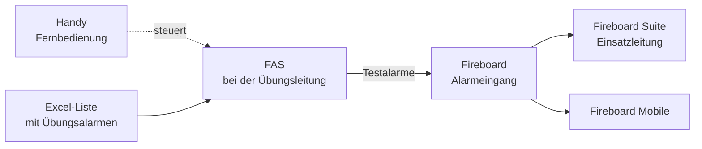
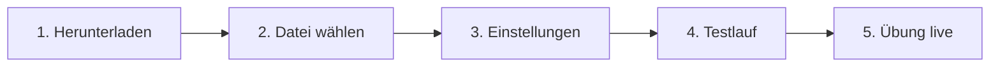
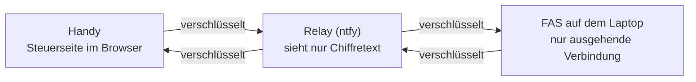

# Fireboard Alarm Simulator (FAS)

**Übungsalarme für Fireboard – einfach aus einer Excel-Liste.**

**[Neueste Version herunterladen](https://github.com/kventil/fireboard-alarm-simulator-releases/releases/latest)**
für Windows und Mac · Website: [fireboard-simulator.de](https://fireboard-simulator.de/)

Du planst eine Übung für deine Feuerwehr, zum Beispiel eine Unwetterlage mit
vielen Alarmen gleichzeitig? FAS spielt dabei die **Leitstelle**: Es schickt
die Alarme aus deiner Excel-Liste in euren **Fireboard-Alarmeingang** – nach
und nach, zu festen Zeiten oder auf Knopfdruck. Eure Führungskräfte arbeiten sie
in Fireboard ab wie echte Alarme.

**Steuern per Handy:** Die Übungsleitung muss nicht am Laptop bleiben. QR-Code
scannen, und das Handy wird zur Fernbedienung – Alarme senden, Lage-Updates
auslösen, pausieren, von überall mit Internet. Keine App, Ende-zu-Ende verschlüsselt.
Mehr unter [Handy als Fernbedienung](#handy-als-fernbedienung).


```mermaid
flowchart LR
    H["Handy<br/>Fernbedienung"] -.->|steuert| B
    A["Excel-Liste<br/>mit Übungsalarmen"] --> B["FAS<br/>bei der Übungsleitung"]
    B -- "Testalarme" --> C["Fireboard<br/>Alarmeingang"]
    C --> D["Fireboard Suite<br/>Einsatzleitung"]
    C --> E["Fireboard Mobile"]
```

Alle Alarme sind in Fireboard als **Testalarme** gekennzeichnet. FAS alarmiert
**keine Einsatzkräfte** – es gibt keine Piepser-, SMS- oder App-Alarmierung,
die Alarme landen nur im Alarmeingang von Fireboard.

## Was FAS kann

- **Fernbedienung per Handy** – Übung vom Handy aus steuern, auch unterwegs, ohne App
- **Alarme automatisch verteilen** – z. B. 4 Alarme alle 10 Minuten zu zufälligen Zeitpunkten
- **Drehbuch** – bestimmte Alarme zu festen Zeiten („nach 20 Minuten brennt die Scheune“)
- **Von Hand** – die Übungsleitung schickt jeden Alarm selbst ab
- **Lage-Updates** – ein Alarm verschärft sich im Lauf der Übung (B2 → B3)
- **Zufallsalarme** – FAS würfelt Alarme aus einer Stichwort- und Adressliste zusammen
- **Testlauf** – alles ausprobieren, ohne dass etwas gesendet wird
- **Protokoll** – jede Meldung mit Uhrzeit, für die Nachbesprechung
- **Fortsetzen** – Laptop ausgegangen? Die Übung geht dort weiter, wo sie aufgehört hat

## Was du brauchst

- einen **Laptop oder PC mit Windows 10/11** (ein Mac geht auch, siehe [Mac](#mac))
- ein **Fireboard-Konto** mit dem Modul *Alarmverarbeitung* – den dazugehörigen
  **AuthKey** findest du im Fireboard-Portal unter *Benutzerkonto →
  AuthKey-Verwaltung* (Eintrag „Alarmverarbeitung PLUS“)
- eine **Excel-Liste** mit deinen Übungsalarmen – zwei Beispiele sind dabei
- einen Laptop, der **nicht in den Standby geht**: in den Energieoptionen
  *Standby* und *Ruhezustand* ausschalten, das Netzteil anschließen.
  „Bildschirm aus“ ist in Ordnung. Geht der Laptop trotzdem schlafen, hält FAS
  die Übung selbst an und sagt es dir.

Installieren musst du nichts.

---

## In 5 Minuten zur ersten Übung


```mermaid
flowchart LR
    S1["1. Herunterladen"] --> S2["2. Datei wählen"] --> S3["3. Einstellungen"] --> S4["4. Testlauf"] --> S5["5. Übung live"]
```

### 1. Herunterladen

Auf der
[Download-Seite](https://github.com/kventil/fireboard-alarm-simulator-releases/releases)
bei der neuesten Version die Datei **`…-windows-x64.zip`** herunterladen und
entpacken (Rechtsklick → *Alle extrahieren*). Im Ordner liegen:

- `fas.exe` – das Programm
- `alarmdaten.xlsx` und `alarmdaten_tecklenburg.xlsx` – Beispiel-Listen
- `README.md` – diese Anleitung (Bilder im Ordner `docs`)

### 2. Starten und Alarmliste wählen

**Doppelklick auf `fas.exe`.** Es öffnet sich ein Fenster mit dem
Startbildschirm. Mit den Pfeiltasten `↑` `↓` die Excel-Liste auswählen, dann
`Enter` – oder die Datei mit der Maus anklicken (zweiter Klick: weiter). Wurde
die letzte Übung mit einer Datei nicht beendet, steht das direkt darunter.


> **Windows warnt beim ersten Start?** („Der Computer wurde durch Windows
> geschützt“) – das ist bei neuen Programmen normal. Auf *Weitere
> Informationen* → *Trotzdem ausführen* klicken.

Eigene Liste? Einfach die Excel-Datei in den Ordner von `fas.exe` legen – sie
erscheint dann hier. Oder die Datei direkt **auf `fas.exe` ziehen**.

### 3. Einstellungen

Mit `↑` `↓` zwischen den Zeilen wechseln, mit `←` `→` oder der Leertaste die
Auswahl ändern – oder die gewünschte Option mit der Maus anklicken. Zahlen einfach eintippen. Unter den Einstellungen steht, was
die gewählte Zeile bewirkt.


| Einstellung | Bedeutung |
|---|---|
| **Senden** | *Testlauf*: nichts wird gesendet – zum Ausprobieren. *Live*: die Alarme gehen an Fireboard. |
| **Ablauf** | *Von Hand*: du schickst jeden Alarm selbst ab. *Automatisch*: FAS verteilt die Alarme, z. B. 4 Alarme alle 10 Minuten. |
| **Zufallsalarme** | Zusätzliche, zufällig zusammengestellte Alarme (nur bei Listen mit Zufallsdaten). |
| **Was tun?** | Normalerweise *Übung starten*. Nach der Übung: *Alle Alarme der Datei schließen*. |

### 4. Erst mal testen

Lass *Senden* beim ersten Mal auf **Testlauf** und drück `Enter`. Die
Übungsansicht öffnet sich – du kannst in Ruhe alles ausprobieren, in Fireboard
kommt nichts an. Beenden mit `q`.

### 5. Übung live

FAS noch einmal starten, bei *Senden* **Live** wählen und `Enter`. Jetzt fragt
FAS nach dem **AuthKey**: eintippen oder mit Rechtsklick / `Strg+V` einfügen,
dann `Enter`. FAS zeigt nur Punkte und die Länge (der Bildschirm kann auf einen
Projektor gespiegelt sein); mit `F2` blendest du bei langen Keys die letzten vier
Zeichen ein, damit du siehst, ob der richtige Key vollständig eingefügt ist. Ob der Key
stimmt, kann der Startbildschirm nicht prüfen – das zeigt sich erst beim ersten
Alarm. Ein falscher Key hält die Übung an und FAS gibt einen Hinweis. Der Key wird
**nicht gespeichert** und bei jedem Start neu
abgefragt – außer du setzt mit `Tab` das Häkchen bei *AuthKey speichern*. Dann
legt FAS ihn geschützt auf diesem Computer ab und fragt beim nächsten Mal nicht
mehr (siehe [AuthKey speichern](#authkey-speichern)).


---

## Während der Übung


- **Oben** siehst du, ob wirklich gesendet wird (**LIVE**) oder nur geübt wird
  (**TESTLAUF**), welche Datei läuft und wie viele Alarme schon raus sind.
  Format, AuthKey, Protokolldatei und Zufallsdaten zeigt `?`.
- **Übungszeit** läuft seit dem Start; bei Pause bleibt sie stehen.
- **Die Liste** zeigt jeden Alarm: `Z4` ist Zeile 4 deiner Excel-Liste. Die
  Zeit davor ist die Übungszeit, zu der er gesendet wurde (`+5:10`). Die
  Liste nutzt die ganze Fensterhöhe; ein größeres Fenster zeigt mehr Alarme.
- **Unter der Liste** steht alles zum ausgewählten Alarm: Alarmtext,
  Meldebild, Objekt, Meldender und das geplante Lage-Update. Ist das Fenster
  breit genug, stehen daneben **Als Nächstes** (was gleich gesendet wird) und
  der **Verlauf** (was zuletzt passiert ist). In kleinen Fenstern zeigt `i`
  alle Details, `Esc` schließt sie wieder; den ganzen Verlauf zeigt `v` in
  jeder Fenstergröße. Eine **Regie**-Notiz aus der Spalte `regie` steht
  farbig als erste Zeile darunter und auf dem Handy, sie wird nie gesendet.
- **Meldungen** unter der Liste (z. B. „Z3 aus der Warteschlange entfernt“)
  bleiben 8 Sekunden stehen, Rückfragen bis zur Antwort.
- **Ganz unten** stehen nur die Tasten, die für den ausgewählten Alarm gerade
  passen.

| Symbol | Bedeutung |
|---|---|
| `○` | wartet |
| `●` | kommt als Nächstes – mit Countdown |
| `◷` | kommt zu einer festen Zeit ([Drehbuch](#nach-drehbuch)) |
| `✓ gesendet` | gesendet (`✓ Testlauf` im Testlauf) |
| `✗ Fehler 401` | Fehler mit dem Status von Fireboard (`✗ keine Verb.` = Fireboard nicht erreichbar) – was los ist, steht unter der Liste |
| `✓ Lage-Update` | Lage-Update wurde gesendet; bei mehreren Stufen `✓ Lage-Update 2/3` (2 von 3 gesendet) |
| `⟳` | ein Lage-Update kommt automatisch – wann, steht unter der Liste; breite Fenster zeigen den Countdown (`Lage-Update 4:12`, nach der ersten Stufe `nächste 4:12`) |
| `■ geschlossen` | in Fireboard geschlossen |

Hat ein Alarm mehrere [Lage-Updates](#lage-updates), listen die Details jede
Stufe mit ihrem Stand (`✓ gesendet`, `automatisch in 4:12`, `von Hand mit u`),
die Taste heißt dann `Lage-Update 2` und sendet die nächste Stufe. Unter
**Als Nächstes** stehen geplante Stufen (`Lage-Update 2/3`) und das
automatische Schließen (`Schließen`, Spalte `schliessen_nach`).

## Tasten

| Taste | Was passiert |
|---|---|
| `↑` `↓` | Alarm auswählen |
| `Bild↑` `Bild↓` | seitenweise blättern |
| `n` | zum nächsten Alarm springen, der noch nicht gesendet ist |
| `i` | alle Details des Alarms zeigen (`Esc` schließt sie) |
| `v` | den ganzen Verlauf zeigen, neueste zuerst (`↑` `↓` blättern, `Esc` schließt) |
| `?` | Infos zur Übung: Version, Format, AuthKey, Protokolldatei, Zufallsdaten |
| `Enter` | ausgewählten Alarm senden – **Live** fragt erst nach (zweites `Enter` bestätigt), im Testlauf sofort; ein gesendeter Alarm wird nur nach Rückfrage erneut gesendet |
| `Leertaste` | **Übung starten** (die Übung beginnt angehalten), danach **Pause** – alles hält an, bis du noch mal die Leertaste drückst |
| `u` | Lage-Update des Alarms senden (Live mit Rückfrage) |
| `c` | ausgewählten Alarm in Fireboard **schließen** (Live mit Rückfrage) |
| `C` `C` | **alle** gesendeten Alarme schließen (zweimal drücken) |
| `z` | einen [Zufallsalarm](#zufallsalarme) hinzufügen |
| `d` `d` | Alarm für diese Übung streichen (zweimal drücken; die Excel-Liste bleibt unverändert) |
| `h` | [Handy als Fernbedienung](#handy-als-fernbedienung) verbinden |
| `q` | beenden – fragt nach, sobald etwas gesendet wurde (`Strg+C` beendet sofort) |

`Esc` schließt Rückfragen, Details, Verlauf, Info, das Aktionsfenster und den QR-Code – beendet aber nie.

**Mit der Maus:** Ein Klick wählt einen Alarm, das Mausrad blättert. Ein
zweiter Klick auf den ausgewählten Alarm öffnet ein Fenster mit den passenden
Aktionen (senden, Lage-Update, schließen, löschen) – ausgeführt wird erst, wenn
du dort eine Schaltfläche anklickst. Auch die Schaltflächen ganz unten lassen
sich anklicken; *senden*, *Lage-Update* und *schließen* öffnen dabei zuerst
dieses Fenster, *beenden* fragt noch einmal nach. Zum Markieren und Kopieren von
Text die Umschalttaste (Windows) bzw. die Wahltaste ⌥ (Mac) gedrückt halten.

Nach dem Beenden steht im Fenster eine kurze Zusammenfassung: wie viele Alarme
gesendet wurden, wie viele davon in Fireboard noch offen sind (mit dem Weg zum
Aufräumen) und wo das Protokoll liegt. Schon die Rückfrage beim Beenden nennt
die offenen Alarme.

---

## Die Alarmliste (Excel)

Jede Zeile ist ein Alarm, in der ersten Zeile stehen die Spaltennamen. Am
einfachsten nimmst du eine der Beispiel-Listen und änderst sie ab.

| externalNumber | keyword | announcement | location | situation |
|---|---|---|---|---|
| UEB-001 | H1 - Unwetter/Baum | ÜBUNG - Baum auf Fahrbahn | Brochterbecker Straße 40, 49545 Tecklenburg | Baum liegt quer über beide Fahrstreifen |
| UEB-002 | H0 - Unwetter/Wasser | ÜBUNG - Wasser im Keller | Markt 5, 49545 Tecklenburg | ca. 20 cm Wasser im Keller |

| Spalte | Was kommt rein? |
|---|---|
| `externalNumber` | Einsatznummer – jede Nummer nur **einmal** |
| `keyword` | Stichwort |
| `announcement` | Alarmtext |
| `location` | Adresse der Einsatzstelle |
| `situation` | Meldebild |

Es gibt noch mehr Spalten – Meldender, Koordinaten, Lage-Updates, feste
Zeiten. Alle stehen in der [Spaltenübersicht](#alle-spalten).

**Tipp:** Telefonnummern und Koordinaten als **Text** eintragen, damit Excel
sie nicht umwandelt.

---

## Übungsarten

### Automatisch verteilt

*Ablauf* → **Automatisch**, dann Anzahl und Minuten einstellen, z. B. **4 Alarme
alle 10 Minuten**. Wann genau die Alarme innerhalb der 10 Minuten kommen, ist
jedes Mal zufällig – die Anzahl stimmt aber immer.

### Von Hand

*Ablauf* → **Von Hand**. Nichts kommt von selbst: Du wählst in der
Übungsansicht einen Alarm aus und schickst ihn mit `Enter` ab – ideal, wenn
die Übungsleitung auf die Lage reagieren will.

### Nach Drehbuch

Für Alarme, die zu einer **festen Zeit** kommen sollen, bekommt die
Excel-Liste eine Spalte **`zeitpunkt`**, gemessen ab Übungsbeginn:

| zeitpunkt | Alarm kommt … |
|---|---|
| `00:00` | sofort beim Start |
| `05:00` oder `5` | nach 5 Minuten |
| `1:10:00` | nach 1 Stunde 10 Minuten |
| `hand` | nie von selbst – nur von Hand senden (Reserve-/Überraschungsalarm) |

Das lässt sich mischen: feste Schlüsselereignisse im Drehbuch, dazwischen
automatisch verteilte oder von Hand geschickte Alarme. Ein Beispiel-Drehbuch:


```mermaid
flowchart LR
    T0["00:00<br/>Keller unter Wasser"] --> T5["05:00<br/>Baum auf Fahrbahn"] --> T20["20:00<br/>Blitzeinschlag Scheune (B2)"] --> T28["28:00<br/>Lage-Update: Vollbrand (B3)"]
```

### Lage-Updates

Ein Alarm kann sich im Lauf der Übung verschärfen, z. B. von „Rauch aus dem
Scheunendach“ (B2) zu „Scheune brennt in voller Ausdehnung“ (B3). Dafür in der
Excel-Liste eintragen:

- `update_keyword` – das neue Stichwort (B3 …)
- `update_situation` – das neue Meldebild
- `update_after` – wie lange nach dem Alarm, z. B. `08:00` für 8 Minuten

Ohne `update_after` löst du das Lage-Update selbst mit der Taste `u` aus.

**Mehrere Stufen** (B2 → B3 → B4): bis zu fünf Lage-Updates pro Alarm, mit den
Spalten `update2_keyword`, `update2_situation`, `update2_after` usw. bis
`update5_…` (deutsch `Lage-Update 2`, `Update-Meldebild 2`, `Update nach 2`).
Die Stufen gehen der Reihe nach raus, `u` sendet immer die nächste. Jede Zeit
zählt **ab dem Senden des Alarms**, nicht ab der Stufe davor: `update_after`
`08:00` und `update2_after` `20:00` heißt B3 nach 8 und B4 nach 20 Minuten.
Eine Stufe wartet auf die davor – ist die noch nicht gesendet (z. B. weil sie
nur von Hand kommt), folgt die nächste sofort danach, wenn ihre Zeit schon
um ist. Jede Stufe ändert nur, was in ihr steht; ein leeres Stichwort lässt
das bisherige stehen.

**Automatisch schließen:** `schliessen_nach` (auch `Schließen nach`) schließt
den Alarm so lange nach dem Senden in Fireboard, z. B. `45:00` – erst wenn er
erfolgreich gesendet wurde. Wer ihn vorher von Hand schließt (`c`, `C` `C`),
hebt das automatische Schließen auf.

### Zufallsalarme

Keine Lust, jeden Alarm einzeln zu schreiben? FAS kann Alarme aus einer
Liste von **Stichwörtern** und einer Liste von **Adressen** zusammenwürfeln –
passend: Die brennende Scheune landet auf einem Hof, der umgestürzte Baum auf
einer Straße. Im Startbildschirm die Anzahl bei *Zufallsalarme* eintragen,
während der Übung kommen mit `z` weitere dazu.

Die Beispiel-Liste `alarmdaten_tecklenburg.xlsx` enthält schon 14 Stichwörter
und 24 Adressen. Wie du eigene anlegst, steht unter
[Zufallsalarme einrichten](#zufallsalarme-einrichten).

---

## Handy als Fernbedienung

Die Übungsleitung muss nicht am Laptop sitzen: Mit dem Handy lassen sich
Alarme senden, Lage-Updates auslösen, Alarme schließen und die Übung
pausieren – von überall, wo das Handy Internet hat. Eine App ist nicht nötig.


**So verbindest du ein Handy:**

1. In der Übungsansicht am Laptop die Taste `h` drücken. Es erscheint ein
   QR-Code. Lässt er sich nicht scannen (z. B. im Mac-Terminal oder in der
   alten Windows-Konsole), öffnet die Taste `b` ihn als Bild in einem eigenen
   Fenster.
2. Den QR-Code mit der Handy-Kamera scannen. Im Browser öffnet sich die
   Fernbedienung und zeigt eine **vierstellige Zahl**.
3. Am Laptop erscheint dieselbe Zahl groß in einem Rahmen. Stimmen beide
   überein, am Laptop `J` drücken (sonst `N`).


Fertig – das Handy zeigt jetzt die nächsten Alarme mit Countdown und die
gesendeten. Antippen einer Karte öffnet die **Details** (siehe unten). Geht ein
Alarm raus, erscheint oben ein Hinweis und das Handy vibriert (abschaltbar
unter *Vibration*; iPhones vibrieren aus dem Browser heraus nicht). Alles, was per Handy passiert, steht im Protokoll mit dem Vermerk
„per Handy“.

**Was die Fernbedienung zeigt:**

<table>
<tr>
<td width="33%" valign="top"></td>
<td width="33%" valign="top"></td>
<td width="33%" valign="top"></td>
</tr>
<tr>
<td valign="top"><b>Zweimal tippen.</b> Im Live-Betrieb wird aus „Senden“ nach dem ersten Tippen ein roter Knopf „Wirklich?“. Erst das zweite Tippen schickt den Alarm – so geht nichts aus Versehen raus.</td>
<td valign="top"><b>Wird übertragen.</b> Bis der Laptop den Befehl bestätigt, dreht sich ein Kreis im Knopf. Das kann ein paar Sekunden dauern – bitte nicht mehrfach tippen.</td>
<td valign="top"><b>Pausiert.</b> Oben steht „Pausiert“, der Knopf heißt jetzt „Fortsetzen“. Ganz unten stehen die Versionen von Steuerseite und FAS.</td>
</tr>
</table>

Die Knöpfe im Überblick:

| Knopf | Was passiert |
|---|---|
| **Senden** | Schickt den Alarm sofort, auch vor seiner geplanten Zeit. |
| **Pause / Fortsetzen** | Hält den automatischen Ablauf an bzw. lässt ihn weiterlaufen. |
| **Zufallsalarm** | Fügt der Liste einen zufälligen Alarm hinzu (nur, wenn die Liste Zufallsdaten hat). Im Modus *Von Hand* schickst du ihn danach noch mit **Senden** ab; im automatischen Ablauf kommt er von selbst. |
| **Lage-Update** | Schickt das Lage-Update zu einem gesendeten Alarm. |
| **Schließen** | Schließt den Alarm in Fireboard. |
| **Notiz** | Hält eine Beobachtung fest, z. B. „Trupp 2 hat Lage falsch gemeldet“ (siehe unten). |

**Details eines Alarms:** Antippen einer Karte öffnet eine eigene Ansicht mit
allem, was der Laptop zu diesem Alarm weiß: Stichwort, Alarmtext, Meldebild,
Ort, Objekt, Ort-Info, Melder (Name · Telefon · Info), Regie, jede Stufe der
Lage-Updates mit ihrem Stand (*gesendet*, *automatisch in 4:12*, *von Hand*),
das geplante Schließen, den Status, das letzte Ergebnis mit Hinweis,
Einsatznummer und uniqueId. Was die Liste schon kennt, steht sofort da; den
Rest holt die Seite in ein, zwei Sekunden vom Laptop. Sehr lange Texte kürzt
der Laptop, damit alles in eine Nachricht passt – vollständig stehen sie am
Laptop unter `i`. Unten in der Ansicht stehen die Knöpfe, die gerade passen
(Senden, Lage-Update, Schließen – im Live-Betrieb ebenfalls mit „Wirklich?“),
und **Notiz zu Z5**. **‹ Zurück**, die Zurück-Geste des Handys oder `Esc`
schließen die Ansicht.

**Notizen:** **Notiz** oben neben Pause (für die ganze Übung) oder **Notiz zu
Z5** in den Details öffnet ein Textfeld für bis zu 500 Zeichen. **Speichern**
schickt die Notiz an den Laptop; sobald er sie bestätigt, erscheint „Notiz
gespeichert“. Kommt keine Bestätigung oder lehnt der Laptop ab, bleibt der Text
stehen, damit du es noch einmal versuchen kannst. Notizen gehen auch vor dem
Start und während einer Pause. Am Laptop landen sie

- als Meldung unten („iPhone: Notiz zu Z5 – …“),
- im **Verlauf** (Panel und Taste `v`) als „Notiz: …“ mit der Zeile des Alarms,
- im [Protokoll](#protokoll) als Aktion `Notiz` mit dem Text und „per Handy (iPhone)“
  in **Meldungen** – für die Nachbesprechung.

Zeilenumbrüche werden zu Leerzeichen, Steuerzeichen entfernt FAS.

Details und Notizen gibt es ab FAS mit Fernbedienungs-API-Level 2; mit einer
älteren FAS-Version blendet die Seite sie aus und klappt Karten wie bisher auf.
Steht am Laptop „Steuerseite veraltet“, kennt die Seite am Handy sie noch nicht.

Sieht das Handy nach einem Update von FAS nicht alle Knöpfe, oder erscheint
„Bitte die Seite neu laden“: die Seite im Browser neu laden oder den QR-Code
noch einmal scannen.

Du kannst die Seite einfach schließen: Öffne sie innerhalb einer Stunde nach
dem letzten Kontakt wieder (Browser-Verlauf oder Lesezeichen), dann verbindet
sie sich von selbst neu – ohne neuen QR-Code. Nach einer Stunde, nach dem
Beenden von FAS oder nach dem Beenden der Fernbedienung mit `x` scannst du den
QR-Code noch einmal. Der Knopf **Trennen** unten auf der Seite beendet die
Verbindung am Handy sofort.

Mit `h` blendest du den QR-Code wieder aus, mit `x` (während er angezeigt wird)
beendest du die Fernbedienung – verbundene Handys haben dann keinen Zugriff
mehr. Beim Beenden von FAS endet sie automatisch.

**Sicherheit in Kürze:** Die Verbindung ist Ende-zu-Ende verschlüsselt. Ein
Handy darf erst steuern, wenn du es am Laptop freigegeben hast, und es kann
nur Alarme der laufenden Übung senden – den AuthKey sieht es nie. Der QR-Code ist
aber der Schlüssel zur Übung: Behandle ihn wie den AuthKey, nicht fotografieren,
nicht weitergeben. Die vierstellige Zahl hilft dir, beim Freigeben das richtige
Handy zu erkennen. Gib nur das Handy frei, mit dem du gescannt hast. Taucht eine
zweite Anfrage auf, die du nicht ausgelöst hast, lehne sie mit `N` ab und beende
die Fernbedienung mit `x`.
Details unter [Fernbedienung: Technik und Sicherheit](#fernbedienung-technik-und-sicherheit).

---

## Nach der Übung

1. **Alarme schließen:** In der Übungsansicht `C` zweimal drücken. Oder später
   FAS starten und im Startbildschirm *Was tun?* → **Alle Alarme der Datei
   schließen** wählen. Geschlossen wird, was laut Protokoll noch offen ist –
   auch aus früheren Übungen mit dieser Liste.
2. **Im Fireboard-Portal löschen:** Schließen blendet die Alarme nur auf den
   Geräten aus. Lösche die Testalarme deshalb im Portal unter *Alarmeingang*,
   bevor die nächste Gruppe übt.
3. **Nachbesprechung:** Neben der Excel-Liste liegt jetzt eine Datei
   `…_protokoll.csv`. Mit Excel öffnen – dort steht jede gesendete Meldung mit
   Uhrzeit, Übungszeit, Ort und Ergebnis, dazu Pausen und gestrichene Alarme
   (siehe [Protokoll](#protokoll)).

---

## Häufige Fragen

**Werden unsere Einsatzkräfte alarmiert?**
Nein. FAS schickt die Alarme nur in den Fireboard-Alarmeingang. Piepser,
Sirene, SMS oder Alarmierungs-Apps werden nicht ausgelöst.

**Sieht man in Fireboard, dass es eine Übung ist?**
Ja, alle Alarme sind als Testalarme gekennzeichnet. Zusätzlich empfehlen wir,
im Alarmtext „ÜBUNG“ voranzustellen – wie in den Beispiel-Listen.

**Wird mein AuthKey gespeichert?**
Nur, wenn du es willst. Ohne dein Zutun gibst du ihn bei jedem Start ein. Auf
Wunsch speichert FAS ihn verschlüsselt auf deinem Computer – siehe
[AuthKey speichern](#authkey-speichern).

**Der Laptop ist mitten in der Übung ausgegangen.**
Einfach FAS wieder starten. Es fragt „Letzte Übung fortsetzen?“ – mit `J` geht
es dort weiter, wo es aufgehört hat. Schon gesendete Alarme werden **nicht**
noch einmal geschickt.

**Fehler 401**
Der AuthKey ist falsch, oder das Modul Alarmverarbeitung ist für euer Konto
nicht freigeschaltet. Den Key im Fireboard-Portal prüfen.

**„keine Verbindung“**
Kein Internet, oder eine Firewall bzw. ein Proxy blockiert. Unter der Liste
steht, woran es wahrscheinlich liegt.

**Statt Symbolen erscheinen seltsame Zeichen.**
Die alte Windows-Konsole kann nicht alle Zeichen darstellen. Unter Windows 11
ist das neue *Windows Terminal* Standard und zeigt alles richtig an.

**Das Handy zeigt „Verbindung unterbrochen“ oder die Fernbedienung am Laptop
„keine Verbindung zum Relay“.**
Beide Geräte brauchen Internet. Die Fernbedienung verbindet sich von selbst neu,
sobald die Verbindung wieder da ist. Die Übung am Laptop läuft in der
Zwischenzeit normal weiter.

**Der Alarm kommt in Fireboard nicht an.**
Im Fireboard-Portal unter *Alarmeingang* nachsehen. Dort lassen sich die
Testalarme nach der Übung auch gesammelt löschen (siehe [Nach der Übung](#nach-der-übung)).

## Feedback

Fehler gefunden oder eine Idee? Schreib es als
[Issue auf GitHub](https://github.com/kventil/fireboard-alarm-simulator-releases/issues/new/choose)
(dafür brauchst du ein kostenloses GitHub-Konto). Issues sind öffentlich –
bitte nie den AuthKey mitschicken. Ohne GitHub-Konto: die E-Mail-Adresse steht
auf der [Website](https://fireboard-simulator.de/#kontakt).

---

## Mac

Die Datei `…-macos-arm64.zip` (Mac mit Apple-Chip, M1 und neuer) bzw.
`…-macos-intel.zip` herunterladen und entpacken. Beim ersten Mal im Programm
*Terminal* die Download-Sperre entfernen und FAS starten:

```
cd ~/Downloads/fireboard-alarm-simulator-2.1.0-macos-arm64
xattr -d com.apple.quarantine fas
./fas
```

Danach genügt ein Doppelklick auf `fas` im Finder.

---
---

# Referenz

Die folgenden Abschnitte beschreiben alle Möglichkeiten im Detail.

## Aufruf und Optionen

```
fas                                   Startbildschirm
fas <exceldatei>                      Startbildschirm mit dieser Datei (auch per Drag & Drop)
fas [optionen] -storedkey <exceldatei> [<intervall-sek> <alarme-pro-intervall>]
fas [optionen] -keyfile <datei> <exceldatei> [<intervall-sek> <alarme-pro-intervall>]
fas [optionen] <exceldatei> <authkey> [<intervall-sek> <alarme-pro-intervall>]
```

Mit Excel-Datei und AuthKey startet FAS direkt ohne Startbildschirm. Der
Startbildschirm zeigt zu den gewählten Einstellungen den passenden Befehl an.
Optionen dürfen vor oder hinter der Excel-Datei stehen.

Am besten nimmst du den gespeicherten Key (`-storedkey`) oder eine Key-Datei
(`-keyfile`). Ein AuthKey, den du als Parameter tippst, ist im Task-Manager und
im Verlauf der Shell zu lesen.

| Parameter | Bedeutung |
|---|---|
| `exceldatei` | Excel-Datei mit den Alarmen und optional den Daten für Zufallsalarme |
| `authkey` | AuthKey der Alarmdatenschnittstelle, besser `-storedkey` oder `-keyfile` (ein Parameter ist im Task-Manager und im Shell-Verlauf sichtbar). `x` = Testlauf, es wird nichts gesendet |
| `intervall-sek` `alarme-pro-intervall` | Optional. Z. B. `600 4`: 4 Alarme je 600 Sekunden zu zufälligen Zeitpunkten. Ohne diese Angaben: manueller Modus |
| `-plain` | Einfache Textausgabe statt Oberfläche (automatischer Modus oder Drehbuch). Wird automatisch verwendet, wenn die Ausgabe umgeleitet wird |
| `-xml` | Alarme im XML-Format senden statt JSON |
| `-close` | Alle laut Protokoll noch offenen Alarme der Excel-Datei in Fireboard schließen und beenden |
| `-random anzahl` | So viele Zufallsalarme erzeugen und an die Alarme der Tabelle anhängen |
| `-seed n` | Startwert für Zufallsalarme: gleicher Seed = gleiche Übung. Ohne Angabe zufällig; der verwendete Seed steht im Kopf der Oberfläche |
| `-resume` / `-fresh` | Eine unterbrochene Übung ohne Nachfrage fortsetzen bzw. neu beginnen |
| `-keyfile datei` | AuthKey aus einer Textdatei lesen statt als Parameter, siehe unten |
| `-savekey` | Den AuthKey (Parameter, `-keyfile` oder Eingabe im Startbildschirm) geschützt auf diesem Computer speichern |
| `-storedkey` | Den gespeicherten AuthKey verwenden statt ihn als Parameter anzugeben |
| `-forgetkey` | Den gespeicherten AuthKey löschen und beenden |
| `-diagnose` | Angaben für die Fehlersuche in `fas_diagnose.txt` schreiben, siehe [Diagnose](#diagnose) |
| `-relay url` | Fernbedienung: eigenen ntfy-Server statt `https://ntfy.sh` verwenden |
| `-remote-page url` | Fernbedienung: eigene Adresse der Steuerseite statt `https://fireboard-simulator.de/remote/` |
| `FAS_URL` | Umgebungsvariable, ersetzt `https://login.fireboard.net/api` (z. B. für einen Testserver) |

Weitere Tasten: `j` `k` (wie `↑` `↓`), `g` / `G` (zum ersten / letzten Alarm),
`Pos1` / `Ende` (wie `g` / `G`), `s` (wie `Enter`), `p` (wie Leertaste),
`Entf` (wie `d`). Mit `Enter` und der Rückfrage lässt
sich ein bereits gesendeter Alarm erneut senden.

### AuthKey speichern

Von sich aus speichert FAS den AuthKey nicht. Für wiederkehrende Übungen kann
es ihn auf dem Computer ablegen – nie im Klartext, sondern geschützt durch das
Betriebssystem:

- **Windows:** verschlüsselt mit der Windows-Datenschutz-API (DPAPI). Der
  Schlüssel dafür hängt am Windows-Benutzerkonto; die Datei
  `%AppData%\FAS\authkey.dpapi` ist für andere Benutzer und auf anderen
  Computern nicht lesbar.
- **Mac:** im Schlüsselbund (Eintrag `fireboard-alarm-simulator`).

Speichern: im Startbildschirm bei der Eingabe des AuthKey mit `Tab` das Häkchen
*AuthKey speichern* setzen, oder einmalig per Befehl:

```
fas -savekey alarmdaten.xlsx <authkey>        # speichert und startet
fas -savekey -keyfile key.txt                 # übernimmt den Key aus einer Datei
```

Verwenden: Der Startbildschirm findet den gespeicherten Key von selbst und
fragt bei *Live* nicht mehr nach; dort lässt er sich auch durch einen neuen
ersetzen (*AuthKey* → *Neu eingeben*). Im Befehl steht `-storedkey` an Stelle
des Keys:

```
fas -storedkey alarmdaten.xlsx 600 4          # startet direkt
fas -forgetkey                                # löscht den gespeicherten Key
```

Der Schutz gilt gegenüber anderen Benutzern, Kopien und Backups des Ordners.
Programme, die unter deinem eigenen Benutzerkonto laufen, können den Key
entschlüsseln – wie bei jedem gespeicherten Passwort. Auf gemeinsam genutzten
Konten den Key deshalb nicht speichern.

### AuthKey aus einer Datei

Alternativ kann der AuthKey in eine Textdatei geschrieben werden (erste Zeile,
z. B. `key.txt`) und mit `-keyfile` übergeben werden. Er taucht dann weder im
Befehl noch in der Eingabe auf, steht in der Datei aber im Klartext:

```
fas -keyfile key.txt alarmdaten.xlsx 600 4    # startet direkt
fas -keyfile key.txt                          # Startbildschirm, Key schon bekannt
```

Unter Windows lässt sich das per Verknüpfung auf einen Doppelklick legen:
Rechtsklick auf `fas.exe` → *Verknüpfung erstellen*, dann in den Eigenschaften
bei *Ziel* hinter `fas.exe` z. B. ` -keyfile key.txt` ergänzen. Die Key-Datei
wie ein Passwort behandeln und nicht weitergeben.

Die Key-Datei wird im aktuellen Ordner und neben dem Programm gesucht. Sie darf
als UTF-8 oder UTF-16 gespeichert sein (Editor, PowerShell).

### Ablauf

Im automatischen Modus sendet der Countdown immer den nächsten noch offenen
Alarm ohne festen Zeitpunkt; von Hand gesendete Alarme verbrauchen keinen Platz
im Intervall. Nach dem letzten Alarm läuft das Programm weiter, damit Updates und
Schließen noch möglich sind.

## Alle Spalten

Die Alarme stehen im ersten Tabellenblatt (die Blätter für Zufallsalarme
ausgenommen). Die Reihenfolge der Spalten ist egal, fehlende Spalten werden
nicht übertragen, leere Zeilen übersprungen.

| Spalte | Inhalt |
|---|---|
| `externalNumber` | Leitstellen-/Einsatznummer |
| `keyword` | Stichwort |
| `announcement` | Alarmnachricht |
| `location` | Anschrift, z. B. `Markt 5, 49545 Tecklenburg` |
| `location_name` | Name des Geschädigten / Objekt |
| `location_info` | Zusatzinfo zur Einsatzstelle |
| `geo_location_auto` | `true`/`false`: automatische Georeferenzierung durch Fireboard |
| `geo_location_latitude`, `geo_location_longitude` | Koordinaten (WGS84, Punkt oder Komma) |
| `reporter_name`, `reporter_phone`, `reporter_info` | Meldender |
| `situation` | Meldebild |
| `timestampStarted` | Beginn des Alarms als Unix-Zeit (Sekunden oder Millisekunden); leer = Zeitpunkt des Eingangs |
| `uniqueId` | *optional* – eindeutige ID, sonst wird `externalNumber` verwendet. FAS hängt bei jeder neuen Übung eine Kennung an (z. B. `-261002193000`), damit Fireboard die Alarme einer wiederholten Übung als neue Alarme anzeigt |
| `update_keyword` | *optional* – neues Stichwort beim Lage-Update |
| `update_situation` | *optional* – neues Meldebild beim Lage-Update |
| `update_after` | *optional* – Update automatisch so lange nach dem Alarm senden: Minuten (`10`), `mm:ss` (`10:00`) oder Sekunden mit `s` (`600s`); leer = nur von Hand mit `u` |
| `update2_keyword` … `update5_after` | *optional* – weitere [Stufen](#lage-updates) wie oben; die Zeit zählt jeweils ab dem Senden des Alarms |
| `schliessen_nach` | *optional* – Alarm so lange nach dem Senden automatisch schließen, gleiche Zeitangaben wie `update_after` (auch `Schließen nach`, `close_after`) |
| `zeitpunkt` | *optional* – Drehbuch: Alarm zu dieser Übungszeit senden: Minuten (`5`), `mm:ss`, `h:mm:ss` oder Sekunden mit `s` (`90s`); `hand` = nur von Hand senden (auch `manuell` oder `-`), z. B. für Reserve- oder Überraschungsalarme; leer = Intervall bzw. von Hand |
| `regie` | *optional* – Regieanweisung, z. B. „Statist liegt im Keller“: steht nur in FAS und auf dem Handy, wird **nie** an Fireboard gesendet (auch `notiz`, `hinweis`, `regieanweisung`) |

- Spaltennamen gehen auch auf Deutsch, Groß-/Kleinschreibung egal: `Einsatznummer`,
  `Stichwort`, `Alarmtext`, `Ort`/`Adresse`, `Objekt`, `Ortsinfo`/`Ort-Info`,
  `Meldebild`, `Melder`/`Meldender`, `Telefon`, `Melderinfo`, `Zeitpunkt`,
  `Lage-Update`/`Update-Stichwort`, `Update-Meldebild`, `Update nach`, `Regie`,
  `Schließen nach`; für weitere Stufen mit Nummer: `Lage-Update 2`,
  `Update-Stichwort 2`, `Update-Meldebild 2`, `Update nach 2`.
- Zeiten (`zeitpunkt`, `update_after`, `schliessen_nach`) werden so gelesen, wie Excel sie anzeigt:
  `05:00` bedeutet 5 Minuten, auch wenn Excel daraus intern eine Uhrzeit macht.
  Eine Zahl ohne Einheit sind **Minuten** (`90` = 90 Minuten). Ältere Listen mit
  Sekunden (`900`) bitte auf `15:00` oder `900s` ändern – FAS warnt beim Start
  bei Zahlen über 180.
- Jeder Alarm braucht eine eindeutige ID, sonst überschreiben sich die Alarme in
  Fireboard. Ohne `uniqueId` und `externalNumber` wird `FAS-<datei>-Z<zeile>`
  verwendet; doppelte IDs werden beim Start gemeldet.
- Ohne Koordinaten entscheidet die Georeferenzierungs-Einstellung im Portal, ob
  die Anschrift aufgelöst wird.
- Zeilen mit Fehlern (z. B. ungültige Zeitangabe) werden beim Start gemeldet und
  übersprungen.

Beispieldateien (in jeder Zip-Datei enthalten): `alarmdaten.xlsx`
(4 Beispielalarme) und `alarmdaten_tecklenburg.xlsx` (24 Unwetter-Alarme mit
Lage-Updates, dazu 14 Stichwörter und 24 Adressen für Zufallsalarme).

## Zufallsalarme einrichten

Die Excel-Datei bekommt zwei weitere Tabellenblätter. Sie verwenden die gleichen
Spaltennamen wie die Alarmtabelle.

**`Stichwörter`** – ein Szenario pro Zeile, z. B. `keyword`,
`announcement`, `situation`, `update_keyword`, `update_situation`,
`update_after`, dazu:

| Spalte | Bedeutung |
|---|---|
| `gewicht` | Wie oft das Szenario im Verhältnis vorkommt (Standard 1; `5` = fünfmal so oft, `0` = nie) |
| `kategorie` | Nur Adressen mit einer dieser Kategorien verwenden, z. B. `landwirtschaft` oder `strasse, wohnhaus` |

**`Adressen`** – eine Einsatzstelle pro Zeile: `location`, `location_name`,
`location_info`, `geo_location_*` und `kategorie` (eine oder mehrere, durch
Komma getrennt).

So entsteht ein Zufallsalarm:

- Ein Szenario wird nach Gewicht gezogen, dazu eine Adresse mit passender
  Kategorie. So brennt die Scheune nur auf einem Hof, und der Baum liegt auf
  einer Straße.
- Jede Adresse kommt erst wieder dran, wenn alle anderen passenden einmal
  verwendet wurden.
- Fehlen `reporter_*`-Spalten, werden fiktive Meldende ergänzt (Nummern
  `0170-555…`).
- Zufallsalarme heißen in der Liste `R1`, `R2`, … und bekommen eindeutige IDs
  wie `ZUF-2609231512-001`.

Mit `-seed` lässt sich eine Übung exakt wiederholen, z. B. 20 Zufallsalarme,
4 je 10 Minuten:

```
fas -random 20 -seed 4711 alarmdaten_tecklenburg.xlsx <authkey> 600 4
```

Eine Datei nur mit den Blättern `Stichwörter` und `Adressen` funktioniert auch –
dann gibt es ausschließlich Zufallsalarme. `fas -close` schließt auch die
laut Protokoll noch offenen Zufallsalarme.

## Lage-Updates und Schließen

Fireboard erkennt einen Alarm an seiner `uniqueId`. Wird dieselbe ID erneut
gesendet, aktualisiert Fireboard den vorhandenen Alarm – so werden Lage-Updates
übertragen.

Damit eine wiederholte Übung mit derselben Excel-Datei neue Alarme erzeugt,
hängt FAS an jede ID die Kennung der Übung an (Startzeitpunkt, z. B.
`TEST100010-260923131002`). Die Einsatznummer (`externalNumber`) bleibt
unverändert. Eine fortgesetzte Übung behält ihre Kennung.

Zum Schließen wird der Alarm mit `timestampClosed` erneut gesendet. Laut
Fireboard-Spezifikation wird er dann **auf den Endgeräten ausgeblendet**; ob das
auch den Alarm in der Fireboard Suite abschließt, ist nicht dokumentiert. Da
die Kennung jeder Übung im Protokoll steht, lassen sich Alarme auch später noch
schließen: mit `c` in der Oberfläche oder `fas -close <datei> <authkey>`.
`-close` schließt alle Alarme der Excel-Datei, die laut Protokoll gesendet und
noch nicht geschlossen wurden, auch aus früheren Übungen – das Protokoll darf
dafür nicht gelöscht oder verschoben werden.

Die Übungszeit, `zeitpunkt` und `update_after` zählen ohne Pausen.

## Fortsetzen nach einer Unterbrechung

Beim Start liest FAS das Protokoll der Excel-Datei. Wurde die letzte Übung
nicht beendet, fragt es:

```
Die letzte Übung mit alarmdaten.xlsx wurde nicht beendet:
  12 Alarme gesendet, 9 davon offen, zuletzt am 23.09. 17:40 bei Übungszeit 0:45:10
Fortsetzen? [J/n]
```

- Beim Fortsetzen werden alle bereits gesendeten, aktualisierten und
  geschlossenen Alarme übernommen (Status „aus Protokoll“) und nicht erneut
  gesendet.
- Die Übungszeit läuft dort weiter, wo sie stehen geblieben ist – die
  Unterbrechung zählt wie eine Pause.
- Zufallsalarme werden mit demselben Seed identisch wiederhergestellt.
- Nicht gefragt wird, wenn am Ende alle gesendeten Alarme geschlossen wurden
  (Übung beendet) oder die letzte Übung ein Testlauf war und jetzt live gesendet
  wird (und umgekehrt).
- Im Startbildschirm erscheint die Frage als eigener Schritt; `-resume` bzw.
  `-fresh` beantworten sie vorab.
  Ohne Terminal (umgeleitete Ausgabe) beginnt die Übung ohne `-resume` neu.

## Fernbedienung: Technik und Sicherheit

Handy und Laptop befinden sich meist in verschiedenen Netzen (Mobilfunk,
Feuerwehrhaus-WLAN) und können sich nicht direkt erreichen. Die Nachrichten
laufen deshalb über ein **Relay**: standardmäßig den öffentlichen, quelloffenen
Dienst [ntfy.sh](https://ntfy.sh). Das Relay ist „blind“ – es sieht nur
zufällige Kanalnamen und verschlüsselte Daten.


```mermaid
flowchart LR
    H["Handy<br/>Steuerseite im Browser"] -- "verschlüsselt" --> R["Relay (ntfy)<br/>sieht nur Chiffretext"]
    R -- "verschlüsselt" --> L["FAS auf dem Laptop<br/>nur ausgehende Verbindung"]
    L -- "verschlüsselt" --> R
    R -- "verschlüsselt" --> H
```

- **Schlüssel:** Der QR-Code enthält einen zufälligen 256-Bit-Schlüssel im
  `#`-Teil der Adresse. Browser schicken diesen Teil an keinen Server; die
  Steuerseite entfernt ihn nach dem Öffnen aus der Adresszeile.
- **Verschlüsselung:** Jede Nachricht ist mit AES-256-GCM verschlüsselt und je
  Richtung gebunden, sodass Nachrichten nicht zurückgespiegelt werden können.
- **Freigabe je Gerät:** Jedes Handy erzeugt ein eigenes Schlüsselpaar (P-256)
  und unterschreibt jeden Befehl. FAS nimmt nur Befehle von Geräten an, die am
  Laptop freigegeben wurden; die vierstellige Zahl auf beiden Geräten stellt
  sicher, dass du das richtige Handy erkennst. Der QR-Code selbst ist der
  Schlüssel: Wer ihn hat, kann ein Handy anmelden und eine Freigabe anfordern.
- **Sitzung auf dem Handy:** Der Sitzungsschlüssel bleibt höchstens eine Stunde
  nach dem letzten Kontakt auf dem Handy gespeichert (damit die Seite nach dem
  Schließen wieder aufgeht). Er wird bei **Trennen** und am Ende der Übung
  gelöscht. Ein verlorenes Handy beendest du mit `x` am Laptop – der
  Sitzungsschlüssel ist danach wertlos.
- **Keine Wiederholungen:** Befehle tragen fortlaufende Nummern, alte oder
  doppelte werden verworfen.
- **Wenig Rechte:** Das Handy kann nur, was die Tasten der Übungsansicht
  können, dazu Notizen schreiben und die Details eines Alarms abrufen (die
  Antwort geht nur an das fragende Handy). AuthKey, Datei und Einstellungen
  bleiben auf dem Laptop. Notizen sind wie alle Befehle unterschrieben; FAS
  entfernt Steuerzeichen, bevor es sie im Terminal oder im Protokoll zeigt,
  die Seite zeigt Texte nur als Text an.
- **Sichtbarkeit:** Wer den QR-Code hat, kann den Übungsstand mitlesen. Steuern
  darf er erst nach deiner Freigabe am Laptop.
- **Nur ausgehend:** FAS öffnet keinen Port. Es gibt keine Firewall-Abfrage und
  keine Router-Einstellung; es funktioniert im WLAN, über Mobilfunk und am
  Hotspot.
- **Versionen:** Die Steuerseite zeigt unten ihre Version und die von FAS
  („Steuerseite v2.0.0 · FAS v2.0.0“), am Laptop steht die Version der Seite
  jedes verbundenen Handys. Die Seite bietet nur Befehle an, die die
  FAS-Version am Laptop kennt. Ist die Seite zu alt, erscheint der Hinweis,
  sie neu zu laden.
- **Grenzen:** Fällt ntfy.sh aus, funktioniert die Fernbedienung nicht – die
  Übung am Laptop läuft normal weiter. Der Übungsstand wird höchstens alle
  5 Sekunden ans Handy geschickt (Grenzen von ntfy.sh).

**Selbst betreiben:** Wer auch das Relay und die Steuerseite in eigener Hand
haben möchte, kann einen eigenen [ntfy-Server](https://docs.ntfy.sh/install/)
(ein einzelnes Programm) aufsetzen und die Dateien aus `web/remote` auf einem
eigenen Webserver ablegen:

```
fas -relay https://ntfy.meine-feuerwehr.de -remote-page https://meine-feuerwehr.de/fas/ …
```

## Protokoll

Jede Übertragung wird an `<exceldatei>_protokoll.csv` neben der Excel-Datei
angehängt (Semikolon-getrennt, öffnet direkt in Excel), jeder Programmstart mit
einer Zeile `Start`. Der AuthKey wird nie protokolliert.

```
Zeitpunkt;Übungszeit;Übung;Aktion;Zeile;uniqueId;Einsatznummer;Stichwort;Ort;Testlauf;HTTP;Ergebnis;Meldungen;Hinweis
23.09.2026 13:10:02;0:00:00;260923131002;Start;;;;;;nein;;neu;run=260923131002 seed=4711 prefix=ZUF-2609231310;
23.09.2026 13:18:26;0:08:24;260923131002;Alarm;Z11;TEST100010-260923131002;TEST100010;B2 - Brand landw. Gebäude;Sundern 12, 49545 Tecklenburg;nein;200;ok;;
23.09.2026 13:21:02;0:11:00;260923131002;Pause;;;;;;nein;;;Pause;
23.09.2026 13:26:26;0:16:24;260923131002;Lage-Update;Z11;TEST100010-260923131002;TEST100010;B3 - Brand landw. Gebäude;Sundern 12, 49545 Tecklenburg;nein;200;ok;Stufe 1;
23.09.2026 13:40:11;0:30:09;260923131002;Schließen;Z11;TEST100010-260923131002;TEST100010;B3 - Brand landw. Gebäude;Sundern 12, 49545 Tecklenburg;nein;200;ok;;
```

- **Übung** trennt mehrere Übungen in einer Datei – in Excel danach filtern.
- **Aktion** ist außer Alarm, Lage-Update und Schließen auch Pause, Weiter,
  Gestrichen (Taste `d`), Angehalten (Übung nach einem Fehler pausiert) und
  Notiz (vom Handy: **Zeile** ist der Alarm oder leer für die ganze Übung,
  **Meldungen** der Text mit „| per Handy (iPhone)“). Beim Fortsetzen werden
  diese Zeilen übergangen.
- Bei mehreren Lage-Updates steht in **Meldungen** die Stufe (`Stufe 2`).
- Beginnt ein Text mit `=`, `+`, `-` oder `@`, setzt FAS ein `'` davor, damit
  Excel ihn nicht als Formel ausführt.

Ein Protokoll im Format einer älteren Version wird beim Start in
`…_protokoll_alt_<datum>.csv` umbenannt und ein neues begonnen.

## Diagnose

Stürzt FAS ab, schreibt es die Datei `fas_diagnose.txt` in den aktuellen Ordner
(ist der nicht beschreibbar, in den Temp-Ordner) und nennt den Pfad. Lässt sich
ein Problem anders nicht erklären – das Fenster schließt sich sofort, die
Key-Datei wird nicht gefunden –, FAS mit `-diagnose` starten:

```
fas -diagnose -keyfile key.txt alarmdaten.xlsx
```

Die Datei enthält dann bei jedem Start: Version und Betriebssystem, den Aufruf,
Angaben zum Terminal, zur Key-Datei (Fundort, Größe, Kodierung), zur
Excel-Datei und zum Protokoll, die Schritte bis zum Ende und bei einem Absturz
die Stelle im Programm. Der AuthKey steht nie darin, nur seine Länge; von den
Alarmen nur die Anzahl und die Warnungen. Die Datei kann einer
[Fehlermeldung](https://github.com/kventil/fireboard-alarm-simulator-releases/issues/new/choose) beigelegt werden; neue Einträge werden
angehängt.

## Fehlermeldungen

Bei Fehlern zeigt FAS die Antwort von Fireboard und darunter (`↳`) die
wahrscheinliche Ursache, z. B.:

| Fehler | Wahrscheinliche Ursache |
|---|---|
| HTTP 400 | Ein Feld der Excelzeile hat einen Wert, den Fireboard nicht akzeptiert |
| HTTP 401 | AuthKey falsch oder Modul Alarmverarbeitung nicht freigeschaltet |
| HTTP 429 | Zu viele Alarme in kurzer Zeit |
| HTTP 500 / 502–504 | Störung oder Wartung bei Fireboard |
| keine Verbindung | Kein Internet, DNS-Problem, Firewall/Proxy oder Zertifikatsproblem |

## Fireboard-Schnittstelle

- Endpunkt: `POST https://login.fireboard.net/api?authkey=…&call=operation_data`
- Standardformat ist JSON nach der
  [OpenAPI-Spezifikation](https://login.fireboard.net/openapi/openapi_fireboard.json)
  ([Swagger](https://login.fireboard.net/swagger/)); mit `-xml` das XML-Format
  `fireboardOperation` aus dem Handbuch. Schließen erfolgt immer per JSON.
- Die Antwort (`status`, `errors`, `warnings`) wird ausgewertet und angezeigt.
- Die Schnittstelle kann nur schreiben: Es gibt keinen Abruf von Alarmen oder
  deren Bearbeitungsstand. Die Auswertung der Übung erfolgt in Fireboard selbst
  (Portal → Alarmeingang).
- Handbuch: [Schnittstelle Alarmdatenübernahme](https://login.fireboard.net/files/handbuecher/Handbuch_Schnittstelle_Alarmdatenuebernahme.pdf)

## Downloads im Detail

| Datei | System |
|---|---|
| `fireboard-alarm-simulator-<version>-windows-x64.zip` | Windows 10/11: Programm `fas.exe`, Beispieldaten, Anleitung |
| `fireboard-alarm-simulator-<version>-macos-arm64.zip` | Mac mit Apple-Chip (M1 und neuer) |
| `fireboard-alarm-simulator-<version>-macos-intel.zip` | Mac mit Intel-Prozessor |
| `checksums.txt` | SHA-256-Prüfsummen |

Für Übungen immer die neueste Version verwenden.
